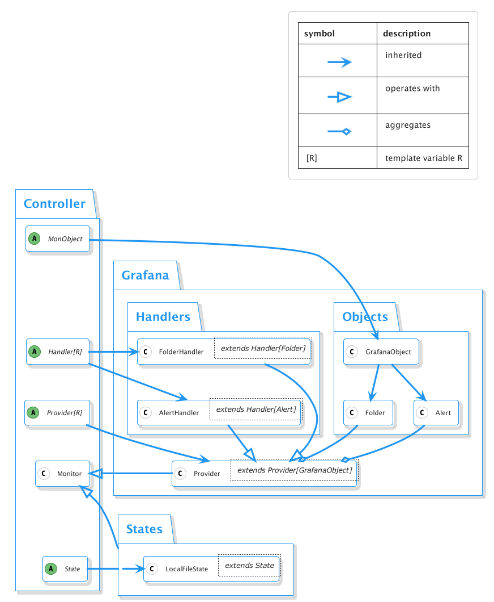

# monitoring-as-code

[](https://badge.fury.io/py/monitoring-as-code)

---

**Stability note:** the package is not mature yet, use with caution and pin particular versions

---

The package provides a simple framework to manage API entities as-code. 
The framework supports CRUD operations on independent objects.

## Supported integrations
* Grafana 8 ([source](monitoring_as_code/binds/grafana)): folders, v8 alert groups

## Install
The package is available at PyPi:
```bash
pip install monitoring-as-code
```

Until the project is mature, please pin a particular version. E.g.:
```bash
pip install monitoring-as-code==0.0.2
```

## How to use
The base framework provides abstractions for a `Provider` to implement. 
The `Provider` represents a remote system, it can enclose dependency resolution logic within a service (e.g. the processing order).

Providers may use a `Handler` to handle objects of a single type.

All instrumented objects must inherit `MonitoringObject` and provide a unique `local_id`. Once an object is inside the processing, it is encapsulated into a `LocalResource`. 
The following resources are present:
* `LocalResource[T]`: represents an object `T` that is only present locally
* `MappedResource[T]`: a local resource with a known remote identifier
* `SyncedResource[T]`: a local object coupled with the corresponding remote state
* `ObsoleteResource[T]`: previously known resource that is no longer defined locally

Refer to the [demo](demo) folder for examples

The components diagram:


## Future plans
1. Extend Grafana provider:
   1. integrate more APIs: data sources, notification channels, permissions.
2. Extract providers to a separate repository. Users will be able to download only necessary providers.
3. Allow to reference fields that are computed by a remote system (e.g.: ids for referencing).
